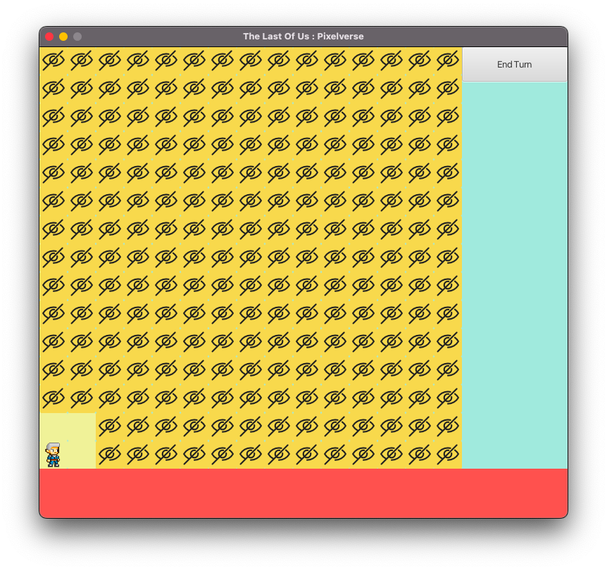
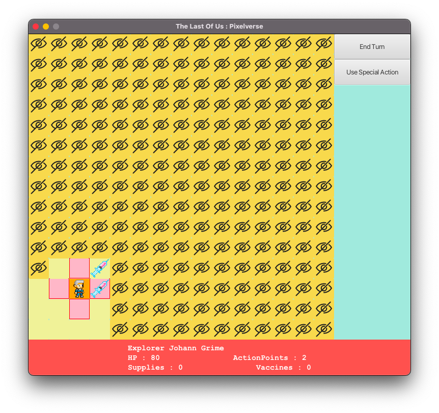
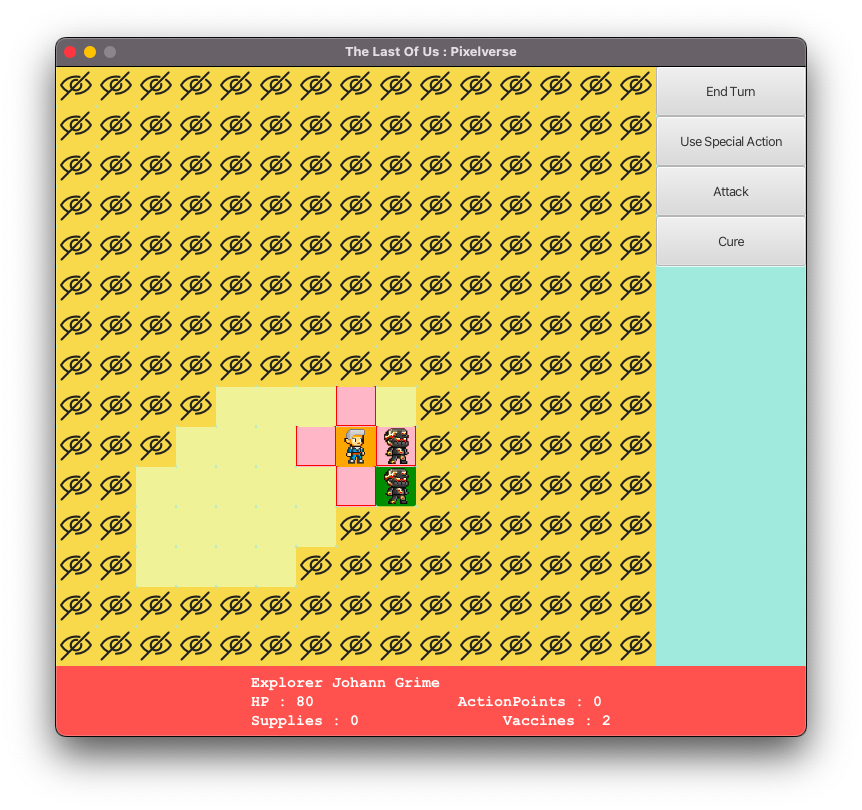
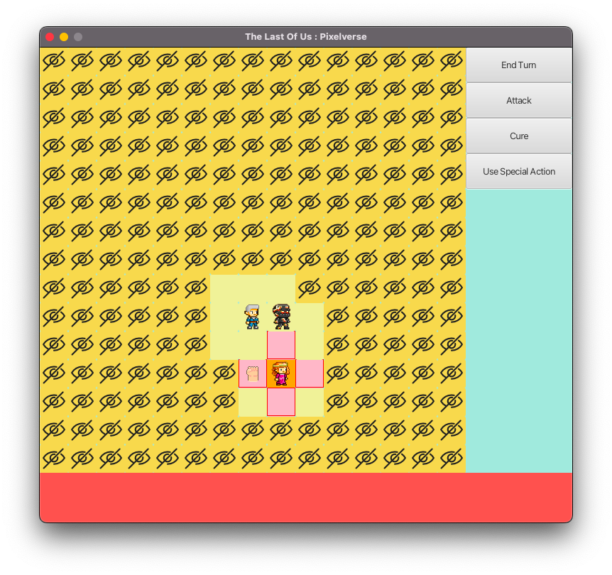
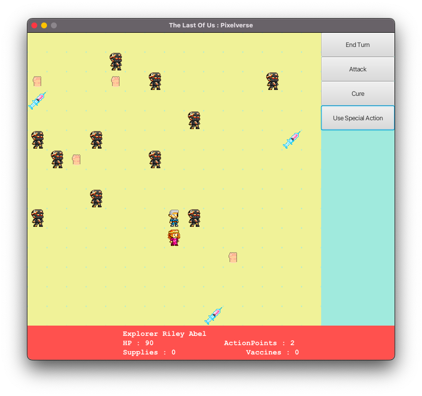

# Zombie Survival Grid

A turn-based 2D grid survival game built in **Java 17 + JavaFX 17**.

Survive a zombie apocalypse on a 15×15 fog-of-war map. Pick a hero, manage action points, collect vaccines to recruit allies, and outlast the undead.

---

> [!Disclaimer]
>
> The game logic, architecture, and all Java source code were originally written by me independently in 2024 as a university OOP course project — no AI assistance was used during original development.
>
> In May 2026 I used [Claude](https://claude.ai) to polish it for my GitHub portfolio. Claude's contributions were limited to:
> - Writing this README
> - Renaming characters and regenerating sprites to remove copyrighted content
> - Adding JavaDoc to the source files
>
> No gameplay logic, algorithms, or architectural decisions were changed by AI.

## Gameplay

- **15×15 grid** with fog-of-war — only the 3×3 area around each hero is visible
- **Three hero classes** with different stats and special abilities:

| Role | Special Ability | Strength |
|---|---|---|
| **Fighter** | Free attack (costs a Supply, no AP) | Highest damage & HP |
| **Medic** | Fully heals an adjacent ally (costs a Supply) | Team sustain |
| **Explorer** | Reveals the entire map (costs a Supply) | High action points |

- **Action economy**: every action (move, attack, cure) costs 1 AP; each hero recharges fully on End Turn
- **Vaccines**: walk over one to pick it up; use it on an adjacent zombie to recruit a benched hero
- **Supplies**: fuel special abilities — pick them up while exploring
- **Traps**: hidden cells that deal 10–30 HP damage on contact
- **Win**: 5+ heroes alive and all vaccines collected or used
- **Lose**: vaccines are gone but you can't reach 5 heroes, or all heroes die

---

## Controls

| Action | How |
|---|---|
| Select a hero | Left-click its cell |
| Move | Click a pink-highlighted adjacent cell |
| Select a zombie | Click its cell (after selecting a hero) |
| Attack | Click zombie → press **Attack** |
| Cure zombie | Click zombie → press **Cure** (costs 1 vaccine) |
| Use special | Press **Use Special Action** (costs 1 supply) |
| Heal ally | Select Medic → click adjacent hero → press **Use Special** |
| End turn | Press **End Turn** |
| Hover any unit | Status bar shows HP, AP, inventory |

---

## How to Run

**Requirements:** A JDK with JavaFX bundled (e.g. [Azul Zulu FX](https://www.azul.com/downloads/?package=jdk-fx)) — no separate JavaFX SDK needed.

**VS Code**
1. Open the project folder in VS Code (with the Java Extension Pack installed)
2. Open `src/View/GUI.java`
3. Click **Run** above the `main` method — the `.vscode/launch.json` already includes the required `--add-modules` flags

**Command line**
```bash
git clone https://github.com/yourusername/zombie-survival-grid.git
cd zombie-survival-grid
javac -d bin $(find src -name "*.java" ! -path "*/tests/*")
java --add-modules javafx.controls,javafx.media,javafx.graphics,javafx.base -cp bin View.GUI
```

---

## Project Structure

```
src/
├── engine/
│   ├── Game.java          # Static game state, turn logic, CSV loading, win/lose
│   └── GameConstants.java # All magic numbers in one place
├── model/
│   ├── characters/        # Character → Hero (Fighter/Medic/Explorer) + Zombie
│   ├── world/             # Cell → CharacterCell / CollectibleCell / TrapCell
│   └── collectibles/      # Collectible interface → Vaccine / Supply
├── exceptions/            # GameActionException hierarchy (5 types)
├── View/
│   └── GUI.java           # JavaFX Application — hero select + 15×15 grid scene
├── Resources/
│   └── icons/             # Hero & zombie sprites, Supply, Vaccine, fog-of-war icons
└── tests/
    └── M2PublicTests.java # 120+ JUnit 4 tests (course-provided)

Heroes.csv                 # Hero roster: name, role, HP, actions, attack
```

---

## Architecture

The code follows a layered structure:

```
View (GUI.java)
    │   registers Game.onMapUpdate = GUI::updateMap at startup
    ▼
Engine (Game.java)   ←──────── calls onMapUpdate.run() to refresh UI
    │
    ▼
Model (characters / world / collectibles / exceptions)
```

**Design patterns used:**
- Inheritance hierarchy — `Character → Hero → Fighter/Medic/Explorer`
- Interface polymorphism — `Collectible` implemented by `Vaccine` and `Supply`
- Abstraction — `Cell → CharacterCell / CollectibleCell / TrapCell`
- Polymorphism — `attack()` in `Character`, overridden in `Hero` and `Zombie`
- Callback decoupling — `Game.onMapUpdate` breaks the Model→View import cycle
- Encapsulation with setters and getters for all non-static variable updates to set Read / Write permissions cleanly . 

**Honest trade-offs** (course-project constraints):
- All game state is `public static` in `Game.java` — simple but non-reusable
- `GUI.java` is a monolithic class (no FXML / external CSS) — working but not idiomatic JavaFX
- No save system, no undo

---

## Tech Stack

- Java 17
- JavaFX 17
- JUnit 4 (test suite)
- Maven 3 (build)

---

## Screenshots

**Hero Selection**


**Game Start**


**Acquiring Cure**


**Zombie Encounter**


**Acquiring Supply**


**Explorer Ability**



## License

MIT — see [LICENSE](LICENSE).

## Assets

See [ASSETS.md](ASSETS.md) for image and icon credits.
